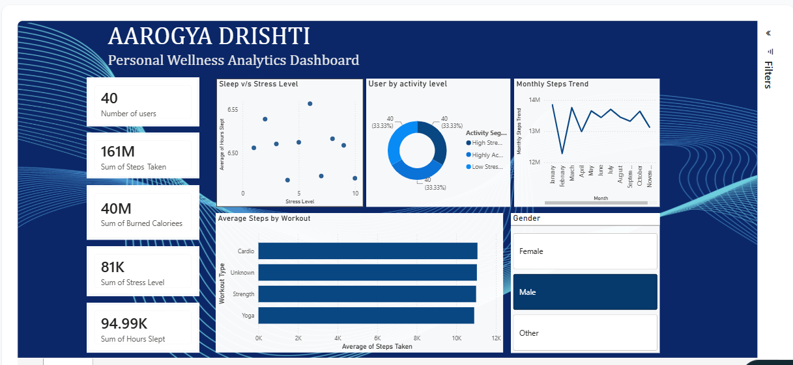

# Aarogya Drishti

### Personal Wellness Analytics Dashboard

Aarogya Drishti is an end-to-end data analytics project that transforms personal wellness and fitness data into meaningful insights using Python, Machine Learning, SQL Server, and Power BI.

## Live Interactive Dashboard

The interactive Power BI dashboard is available here:

[Aarogya Drishti - Open Live Dashboard](https://aarogya-drishti.netlify.app/)

**Note:** The dashboard is embedded from Power BI. You may be required to sign in with a Microsoft account to access the interactive report.

---

## Dashboard Preview



---

## Project Overview

Aarogya Drishti is an end-to-end Personal Wellness Analytics project designed to analyze and visualize key health, fitness, and lifestyle patterns. The project transforms raw wellness data into meaningful insights through data analysis, feature engineering, machine learning, SQL-based analysis, and interactive dashboard development.

The analysis focuses on important wellness metrics such as daily steps, calories burned, sleep duration, stress level, heart rate, water intake, workout type, and mood. Python was used for data cleaning, exploratory data analysis, and feature engineering, while K-Means clustering was used to identify distinct user activity and wellness patterns.

The processed data was further analyzed using SQL Server and visualized through an interactive Power BI dashboard. The dashboard provides key performance indicators, sleep versus stress analysis, activity segment distribution, monthly step trends, workout-based activity insights, and interactive filtering by gender.

The project demonstrates a complete data analytics workflow, from raw data processing to insight generation and business-focused visualization.

---

## Technologies Used

| Technology | Purpose |
|---|---|
| Python | Data cleaning, analysis, and feature engineering |
| Pandas | Data manipulation and preprocessing |
| NumPy | Numerical operations |
| Scikit-learn | K-Means clustering and machine learning |
| Jupyter Notebook | Data analysis and experimentation |
| SQL Server | Data storage and SQL-based analysis |
| Power BI | Interactive data visualization and dashboard development |
| Netlify | Hosting the dashboard access page |
| GitHub | Project documentation and version control |

---

## Dataset

The dataset contains personal wellness and fitness records tracked over time.

### Key Features

- User_ID
- Date
- Age
- Gender
- Height_cm
- Weight_kg
- Steps_Taken
- Calories_Burned
- Hours_Slept
- Water_Intake_Liters
- Active_Minutes
- Heart_Rate
- Workout_Type
- Stress_Level_1_10
- Mood

### Derived Features

Additional features were created during the analysis process:

- BMI
- Month
- Day
- Cluster
- Activity_Segment

---

## Project Workflow

```text
Raw Wellness Dataset
        ↓
Data Cleaning and Preprocessing
        ↓
Feature Engineering
(BMI, Month, Day)
        ↓
Exploratory Data Analysis
        ↓
Machine Learning
(K-Means Clustering)
        ↓
Activity Segmentation
        ↓
SQL Server Analysis
        ↓
Power BI Dashboard Development
        ↓
Netlify Hosted Access Page
